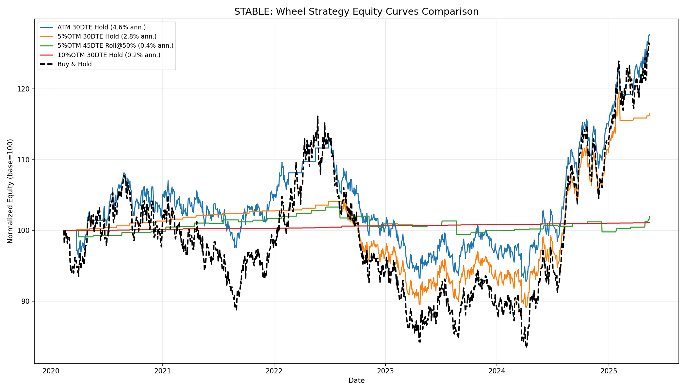
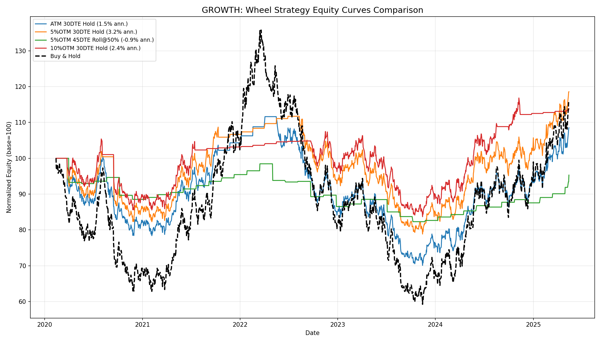
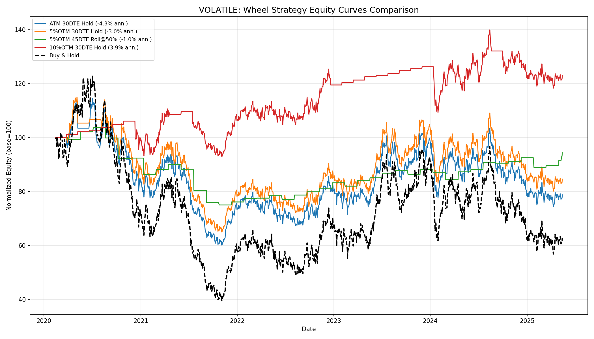
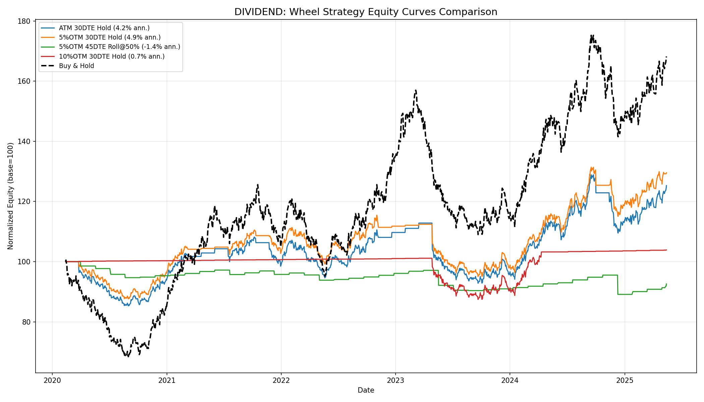
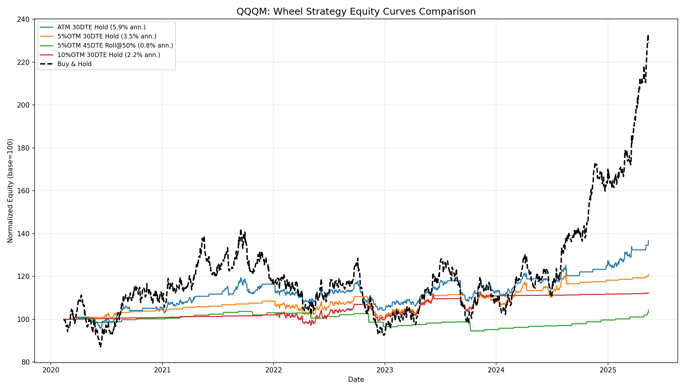
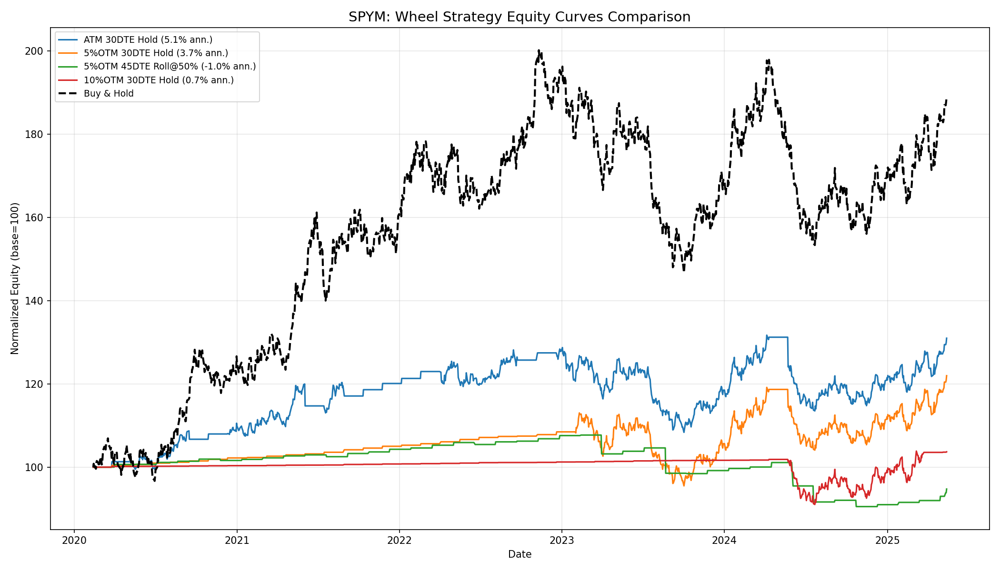

# Wheel Strategy Study

A systematic backtest of the **wheel strategy** (cash-secured puts → covered calls) across different strike selections, DTEs, roll methods, and stock profiles.

## Overview

The wheel strategy is an options income strategy that:
1. **Sells cash-secured puts** — collect premium while waiting to buy stock at a discount
2. **If assigned**, switches to **selling covered calls** — collect premium while waiting to sell stock at a profit
3. Repeats the cycle

This study evaluates **192 parameter combinations** (4 strikes × 3 DTEs × 4 roll methods × 4 stock profiles × 3 time periods) to identify which configurations work best under different market conditions.

## Running the Study

```bash
# Synthetic data (default — 4 stock profiles)
python wheel_study.py --synthetic

# Real data from a directory of CSV files
python wheel_study.py --data /path/to/price_data/

# Single ticker
python wheel_study.py --ticker AAPL.csv
```

Results are saved to the `results/` folder as CSVs, PDFs, and PNGs.

## Parameters Tested

| Parameter | Values |
|-----------|--------|
| **Strike** | ATM, 3% OTM, 5% OTM, 10% OTM |
| **DTE** | 30, 45, 60 days |
| **Roll Method** | Hold to Expiry, Roll @50% Profit, Roll @75% Profit, Roll 7 Days Before Expiry |

## Synthetic Stock Profiles

| Ticker | Annual Return | Volatility | Price | Character |
|--------|--------------|------------|-------|-----------|
| STABLE | 8% | 15% | $50 | Low-vol, steady grower |
| GROWTH | 15% | 25% | $150 | High-growth, moderate vol |
| VOLATILE | 5% | 40% | $100 | High-vol, low return |
| DIVIDEND | 6% | 18% | $60 | Income stock, low vol |

## Results

### Best Configuration by Time Period

| Period | Ticker | Best Config | Ann. Return | Max Drawdown |
|--------|--------|-------------|-------------|--------------|
| 1Y | GROWTH | ATM, 60 DTE, Roll @7d | 45.9% | 0.0% |
| 1Y | VOLATILE | ATM, 60 DTE, Roll @7d | 27.9% | -4.7% |
| 1Y | STABLE | ATM, 60 DTE, Roll @7d | 23.1% | 0.0% |
| 1Y | DIVIDEND | ATM, 45 DTE, Roll @7d | 14.8% | -8.1% |
| 3Y | VOLATILE | ATM, 60 DTE, Roll @50% | 10.2% | -8.2% |
| 3Y | GROWTH | 10% OTM, 30 DTE, Hold | 5.7% | -30.9% |
| 3Y | STABLE | ATM, 45 DTE, Roll @7d | 5.2% | -4.4% |
| 3Y | DIVIDEND | ATM, 60 DTE, Roll @7d | 4.8% | -13.2% |
| 5Y | GROWTH | ATM, 60 DTE, Roll @7d | 5.7% | -18.4% |
| 5Y | DIVIDEND | 10% OTM, 30 DTE, Hold | 5.0% | -8.4% |
| 5Y | STABLE | ATM, 45 DTE, Roll @7d | 3.6% | -6.3% |
| 5Y | VOLATILE | ATM, 45 DTE, Roll @7d | 2.5% | -32.9% |

### Aggregate: By Strike Selection

| Strike | Avg Ann. Return | Avg Max DD | Avg Win Rate |
|--------|----------------|------------|--------------|
| **ATM** | **5.68%** | -15.1% | 80.5% |
| 3% OTM | 3.88% | -12.8% | 83.1% |
| 5% OTM | 2.93% | -11.1% | 85.3% |
| 10% OTM | 1.63% | -7.0% | 86.7% |

Higher premium (ATM) = higher returns but deeper drawdowns. Wider OTM = safer but less income.

### Aggregate: By DTE

| DTE | Avg Ann. Return | Avg Max DD | Win Rate |
|-----|----------------|------------|----------|
| 30 | 2.39% | -12.2% | 81.4% |
| 45 | 3.58% | -11.3% | 85.0% |
| **60** | **4.62%** | **-11.1%** | **85.3%** |

60 DTE wins on both return and risk. More time value per contract, fewer transaction costs.

### Aggregate: By Roll Method

| Method | Avg Ann. Return | Avg Max DD | Win Rate |
|--------|----------------|------------|----------|
| **Roll @7d Before** | **6.21%** | **-9.8%** | 83.4% |
| Hold to Expiry | 3.22% | -17.4% | 93.1% |
| Roll @50% Profit | 2.73% | -8.8% | 78.3% |
| Roll @75% Profit | 1.95% | -10.0% | 80.9% |

Rolling 7 days before expiry captures most theta decay while avoiding gamma risk and assignment near expiration.

## Equity Curves

### STABLE (8% return, 15% vol)


Wheel strategies mostly outperform buy & hold with smoother equity curves. The low volatility environment lets the strategy collect premium without getting whipsawed.

### GROWTH (15% return, 25% vol)


The wheel caps upside — buy & hold eventually wins on strong uptrends, but the wheel provides meaningfully smoother returns and lower drawdowns along the way.

### VOLATILE (5% return, 40% vol)


This is where the wheel shines. High implied volatility means rich premiums, while the low drift means buy & hold goes nowhere. The 10% OTM strategy earns 3.9% annualized with minimal drawdowns vs. buy & hold's wild swings.

### DIVIDEND (6% return, 18% vol)


Buy & hold edges out the wheel over 5 years due to compounding, but the wheel offers better risk-adjusted returns with shallower drawdowns.

## ETF Case Study: QQQM vs SPYM

To evaluate the wheel on popular index ETFs, we ran the study calibrated to QQQM (Nasdaq-100 micro) and SPYM (S&P 500 micro) characteristics.

| Ticker | Annual Return | Volatility | Price | Index |
|--------|--------------|------------|-------|-------|
| QQQM | 13% | 22% | $180 | Nasdaq-100 |
| SPYM | 11% | 17% | $55 | S&P 500 |

### Best Config per Period

| Period | Ticker | Best Config | Ann. Return | Max Drawdown |
|--------|--------|-------------|-------------|--------------|
| 1Y | QQQM | ATM, 45 DTE, Roll @7d | 31.9% | 0.0% |
| 1Y | SPYM | ATM, 60 DTE, Roll @7d | 28.3% | 0.0% |
| 3Y | QQQM | ATM, 60 DTE, Roll @7d | 9.2% | -6.8% |
| 3Y | SPYM | 10% OTM, 60 DTE, Hold | 5.6% | -6.7% |
| 5Y | QQQM | ATM, 45 DTE, Roll @7d | 5.5% | -8.5% |
| 5Y | SPYM | ATM, 45 DTE, Hold | 5.9% | -13.9% |

### QQQM Aggregates

| Strike | Avg Ann. Return | Avg Max DD | Win Rate |
|--------|----------------|------------|----------|
| ATM | 7.71% | -8.8% | 84.5% |
| 3% OTM | 5.01% | -7.3% | 86.4% |
| 5% OTM | 3.41% | -6.1% | 88.8% |
| 10% OTM | 1.33% | -3.4% | 92.7% |

Best roll method: **Roll @7d Before** (6.75% avg return, -5.6% avg DD)

### SPYM Aggregates

| Roll Method | Avg Ann. Return | Avg Max DD | Win Rate |
|-------------|----------------|------------|----------|
| Roll @7d Before | 6.75% | -5.6% | 88.0% |
| Hold to Expiry | 4.73% | -8.5% | 92.6% |
| Roll @50% Profit | 3.25% | -6.2% | 83.7% |
| Roll @75% Profit | 2.73% | -5.4% | 88.1% |

### QQQM Equity Curves


QQQM's higher volatility (22%) generates richer premiums, but buy & hold wins decisively over 5 years due to the strong 13% annual drift. The wheel caps upside — ATM 30DTE Hold returns 5.9% ann. vs buy & hold's ~13%. Best used tactically in sideways periods.

### SPYM Equity Curves


Similar story for SPYM — the lower volatility (17%) means less premium income. Buy & hold dominates over the full period. The wheel's value here is as a risk-reduction overlay: smoother equity curve with shallower drawdowns, at the cost of capped upside.

### ETF Takeaway

The wheel strategy on broad index ETFs like QQQM and SPYM **underperforms buy & hold over long horizons** because these indices have strong positive drift that the wheel caps. However, the wheel provides:
- **Lower drawdowns** (8-9% vs 20%+ for buy & hold)
- **Steadier income** from premium collection
- **Better risk-adjusted returns** in flat or declining markets

Best use case: deploying the wheel on index ETFs **tactically during range-bound markets**, or as an income overlay for a portion of a portfolio.

## Recommendations

| Scenario | Recommended Config |
|----------|-------------------|
| **Best overall** | ATM or 3% OTM, 60 DTE, Roll @7d before expiry |
| **Best risk-adjusted** | 5–10% OTM, 45–60 DTE, Roll @50% profit |
| **High-vol stocks** | 10% OTM, 30 DTE, Hold to expiry |
| **Income-focused** | ATM, 45 DTE, Roll @7d before expiry |

## Key Takeaways

1. **The wheel works best on moderate-volatility stocks you'd want to own.** It underperforms pure buy & hold on strong uptrends but significantly outperforms on sideways/volatile stocks.

2. **60 DTE is the sweet spot.** Longer-dated options capture more time value per contract and require fewer rolls, reducing transaction costs and slippage.

3. **Rolling 7 days before expiry is optimal.** It captures ~80% of theta decay while avoiding the gamma risk and assignment uncertainty of the final week.

4. **ATM strikes maximize income, OTM strikes maximize safety.** The right choice depends on your risk tolerance and whether you want to own the stock at current prices.

5. **The wheel is fundamentally a volatility-selling strategy.** It profits most when implied volatility exceeds realized volatility — high-IV, range-bound stocks are the ideal candidates.

## Module Reference

| File | Description |
|------|-------------|
| `wheel_study.py` | Main study runner — orchestrates all backtests and generates reports |
| `wheel_backtest.py` | Core backtest engine — simulates put/call selling with assignment logic |
| `cash_secured_put.py` | Cash-secured put position management |
| `wheel_strategy.py` | Full wheel cycle state machine (CSP → CC → CSP) |
| `wheel_candidates.py` | Stock screening for wheel candidates |
| `option_pricing.py` | Black-Scholes pricing for synthetic option premiums |
