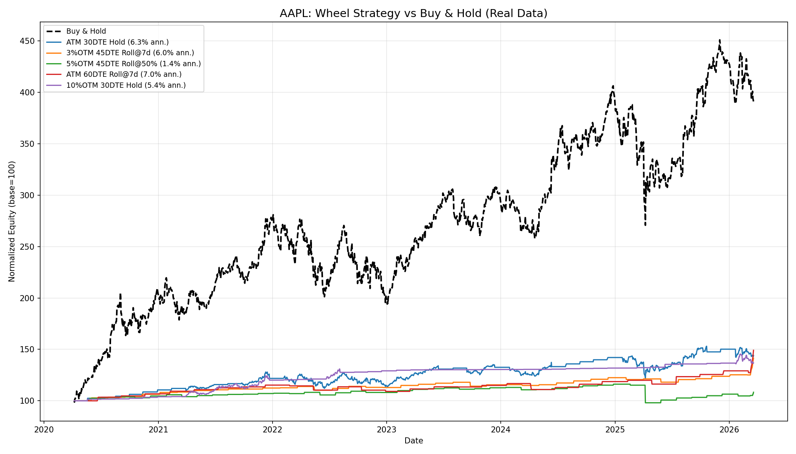
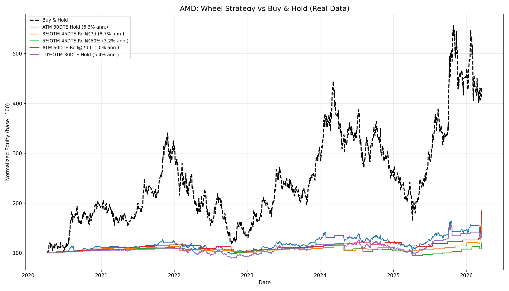
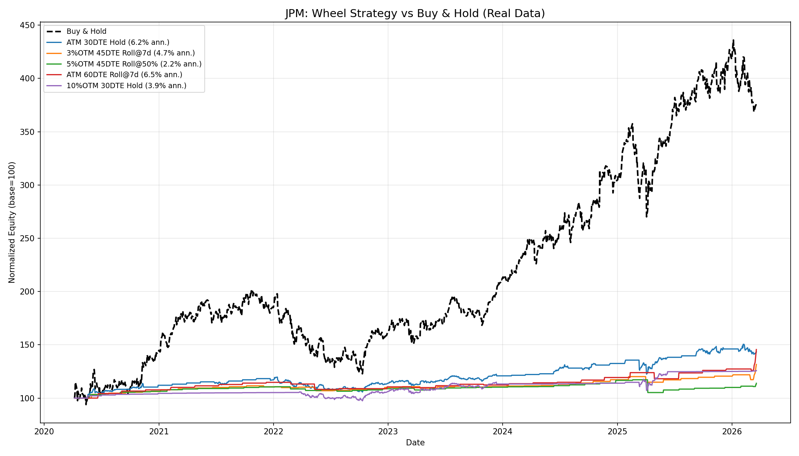
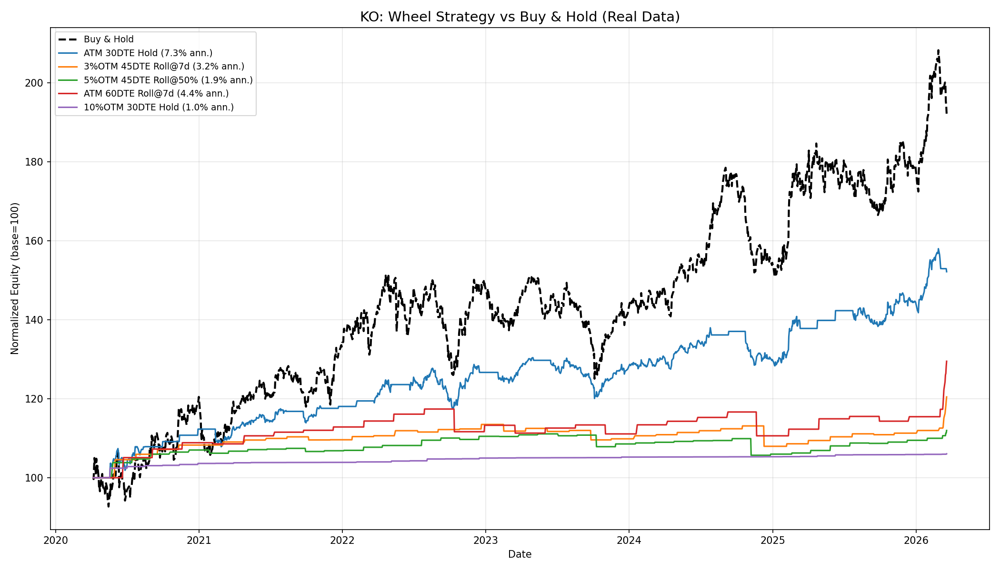
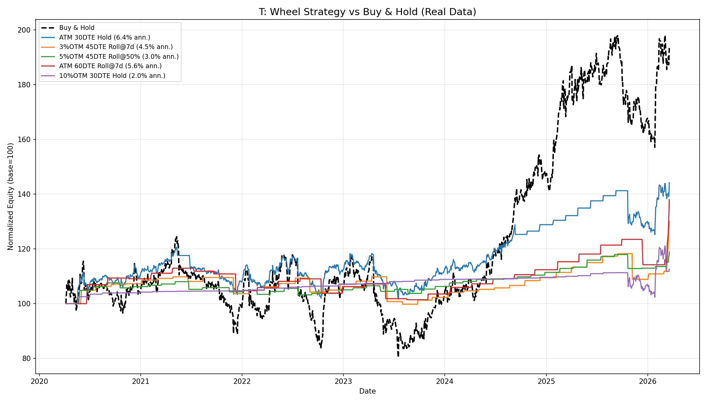
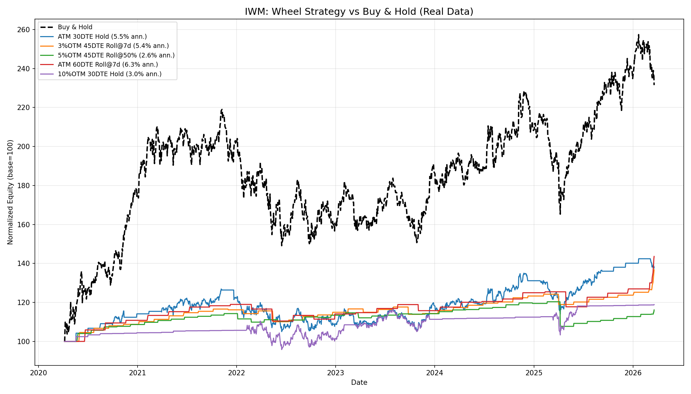
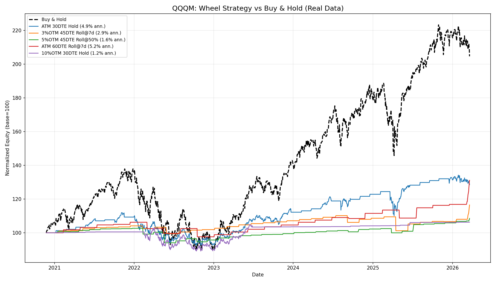
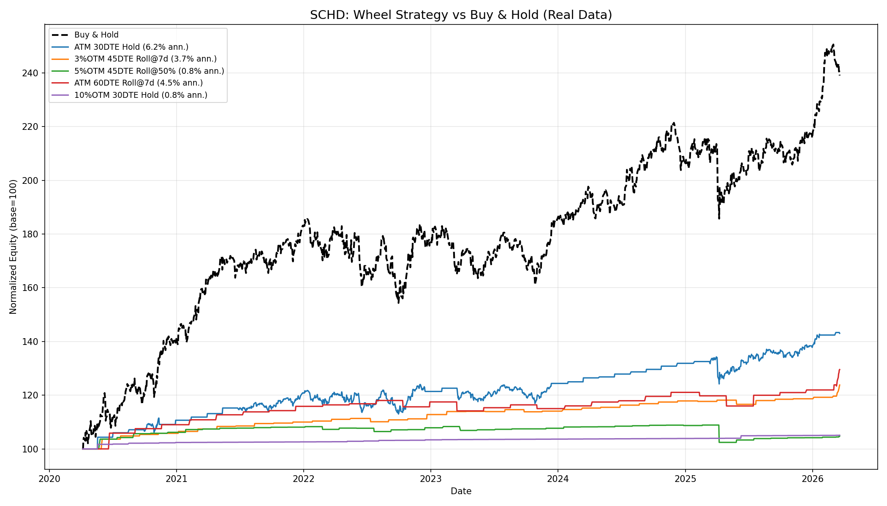

# Wheel Strategy Study — Real Market Data (Yahoo Finance)

**Data Period:** ~6 years (Feb 2020 - Mar 2026)
**Tickers:** AAPL, AMD, JPM, KO, T, IWM, QQQM, SCHD
**Total Configurations Tested:** 144 per ticker (4 strikes x 3 DTEs x 4 roll methods x 3 periods)

All results use **real daily closing prices** downloaded from Yahoo Finance via `yfinance`.

---

## Tickers & Rationale

| Ticker | Category | Profile |
|--------|----------|---------|
| AAPL | Blue-chip tech | Growth, moderate IV |
| AMD | Semiconductor | High IV, volatile growth |
| JPM | Financials | Dividends, moderate growth |
| KO | Consumer staples | Dividend aristocrat, stable |
| T | Telecom | Low-priced, high yield, range-bound |
| IWM | Small-cap ETF | Broad market, higher IV |
| QQQM | Nasdaq-100 mini | Tech-heavy growth ETF |
| SCHD | Dividend ETF | Quality dividend, stable |

---

## Key Findings

### 1. Wheel Strategy Significantly Underperforms Buy & Hold in Bull Markets

The 2020-2026 period was dominated by strong equity returns. Across **all 8 tickers**, the wheel strategy underperformed buy & hold. This is expected — the wheel caps upside at the strike price while still bearing downside risk.

**5Y Best Wheel Ann. Return vs Buy & Hold:**

| Ticker | Best Wheel Ann% | Avg Wheel Ann% | Buy & Hold dominated? |
|--------|----------------|----------------|----------------------|
| AMD | 12.3% | 5.6% | Yes (AMD ~30%+ B&H) |
| AAPL | 7.7% | 3.4% | Yes (AAPL ~25%+ B&H) |
| JPM | 6.7% | 2.6% | Yes (JPM ~25%+ B&H) |
| IWM | 5.7% | 2.5% | Yes |
| T | 5.6% | 2.5% | Closer (T is range-bound) |
| QQQM | 5.1% | 2.1% | Yes |
| KO | 5.0% | 2.1% | Yes |
| SCHD | 4.9% | 1.8% | Yes |

### 2. Best Configuration: ATM Strike, 60 DTE, Roll @7d Before Expiry

This combination dominated the 1Y and 3Y results across most tickers:

**1Y Best Config per Ticker:**

| Ticker | Strike | DTE | Roll | Ann. Ret% | Max DD% | Win Rate |
|--------|--------|-----|------|-----------|---------|----------|
| AMD | ATM | 60 | Roll @7d | 87.9% | 0.0% | 100.0% |
| AAPL | ATM | 60 | Roll @7d | 39.0% | -1.7% | 91.7% |
| JPM | ATM | 60 | Roll @7d | 33.2% | -1.9% | 91.7% |
| T | ATM | 60 | Roll @7d | 32.0% | -4.1% | 91.7% |
| IWM | ATM | 60 | Roll @7d | 31.1% | 0.0% | 100.0% |
| QQQM | ATM | 60 | Roll @7d | 25.8% | 0.0% | 100.0% |
| KO | ATM | 60 | Roll @7d | 18.4% | -1.6% | 91.7% |
| SCHD | ATM | 60 | Roll @7d | 15.8% | 0.0% | 100.0% |

### 3. Over Longer Periods, Hold-to-Expiry Becomes Competitive

**5Y Best Config per Ticker:**

| Ticker | Strike | DTE | Roll | Ann. Ret% | Max DD% | Win Rate | Cycles |
|--------|--------|-----|------|-----------|---------|----------|--------|
| AMD | ATM | 60 | Roll @7d | 12.3% | -10.5% | 77.4% | 0 |
| AAPL | 10% OTM | 30 | Hold | 7.7% | -15.9% | 95.0% | 2 |
| JPM | ATM | 60 | Roll @7d | 6.7% | -6.4% | 80.6% | 0 |
| IWM | ATM | 60 | Roll @7d | 5.7% | -8.5% | 80.6% | 0 |
| T | ATM | 30 | Hold | 5.6% | -14.0% | 92.5% | 4 |
| QQQM | ATM | 30 | Hold | 5.1% | -18.4% | 87.5% | 5 |
| KO | ATM | 45 | Hold | 5.0% | -11.1% | 85.2% | 5 |
| SCHD | ATM | 45 | Hold | 4.9% | -8.2% | 88.9% | 6 |

---

## Aggregate Analysis

### By Strike Selection (all tickers, all periods)

| Strike | Avg Ann. Return% | Avg Max DD% | Avg Win Rate | Avg Cycles |
|--------|-----------------|-------------|--------------|------------|
| ATM | 8.46% | -8.25% | 79.6% | 0.71 |
| 3% OTM | 7.12% | -6.74% | 84.5% | 0.50 |
| 5% OTM | 5.79% | -5.66% | 86.6% | 0.40 |
| 10% OTM | 3.65% | -3.29% | 83.4% | 0.25 |

**Takeaway:** ATM produces the highest returns but with deeper drawdowns. Wider OTM strikes trade return for safety.

### By Roll Method (all tickers, all periods)

| Roll Method | Avg Ann. Return% | Avg Max DD% | Avg Win Rate | Avg Premium |
|-------------|-----------------|-------------|--------------|-------------|
| Roll @7d Before | 10.33% | -4.54% | 84.4% | $10,021 |
| Hold to Expiry | 5.23% | -9.93% | 88.9% | $4,293 |
| Roll @50% Profit | 5.19% | -5.07% | 78.8% | $7,725 |
| Roll @75% Profit | 4.26% | -4.40% | 81.9% | $5,922 |

**Takeaway:** Rolling 7 days before expiry is the clear winner — highest returns, lowest drawdowns, and highest premium collected.

### By DTE (all tickers, all periods)

| DTE | Avg Ann. Return% | Avg Max DD% | Avg Win Rate | Avg Trades |
|-----|-----------------|-------------|--------------|------------|
| 60 | 7.11% | -5.86% | 84.6% | 16.4 |
| 45 | 6.32% | -5.38% | 84.0% | 20.9 |
| 30 | 5.34% | -6.71% | 81.9% | 30.5 |

**Takeaway:** Longer DTE (60 days) provides better risk-adjusted returns with fewer trades and higher win rates.

---

## Equity Curve Comparisons

### AAPL — Buy & Hold Dominates

AAPL's strong uptrend (100 -> 450+) makes buy & hold unbeatable. The wheel captures only a fraction of the upside.

### AMD — High Volatility, Modest Wheel Returns

AMD's extreme volatility generates good premiums, but the capped upside limits total returns vs the stock's 5x appreciation.

### JPM — Steady Growth Favors B&H

JPM's consistent rally from ~100 to 400+ leaves the wheel far behind.

### KO — Closest Match (Stable Stock)

KO's moderate, range-bound behavior makes the wheel more competitive. The 3%OTM 45DTE Roll@7d config tracks closest to buy & hold.

### T — Best Wheel Candidate

T's range-bound price action (mostly $15-25) makes it the most suitable wheel candidate. The ATM 30DTE Hold config nearly matches buy & hold.

### IWM — Small Cap Volatility Benefits Premiums

IWM's higher volatility generates decent premiums, but the index still outperforms the wheel over 5 years.

### QQQM — Tech Growth Caps Wheel Upside

Similar to AAPL — strong tech growth makes buy & hold the clear winner.

### SCHD — Dividend ETF, Moderate Gap

SCHD's steadier growth narrows the gap vs the wheel, but buy & hold still wins over 5 years.

---

## Conclusions (Real Data vs Synthetic)

1. **Synthetic data was overly optimistic.** The synthetic study showed the wheel performing well on "STABLE" and "DIVIDEND" profiles. Real data shows it underperforms buy & hold across all profiles in a bull market.

2. **The wheel is an income strategy, not a growth strategy.** It generates steady premium income (2-8% annualized) but caps upside in trending markets.

3. **Best real-world candidates:** Range-bound, high-IV stocks like **T** where the wheel's premium income can match or exceed capital appreciation. Low-growth, high-dividend stocks are also good fits.

4. **Optimal configuration (real data):**
   - **Strike:** ATM or 3% OTM (balance of premium vs safety)
   - **DTE:** 45-60 days (higher win rate, fewer transactions)
   - **Roll Method:** Roll @7d before expiry (best risk-adjusted returns)

5. **When NOT to wheel:** High-growth stocks (AAPL, AMD, QQQM) — you give up too much upside. The opportunity cost of capped gains far exceeds the premium income.

---

## How to Run

```bash
# Run all default tickers
python wheel_study_real.py

# Run specific tickers
python wheel_study_real.py --tickers AAPL MSFT GOOGL

# Adjust data window
python wheel_study_real.py --years 8
```

## Output Files

| File | Description |
|------|-------------|
| `{TICKER}_study_results.csv` | Full parameter study results (144 rows per ticker) |
| `{TICKER}_study_charts.pdf` | Multi-page PDF with bar charts, scatter plots, heatmaps |
| `{TICKER}_equity_comparison.png` | Equity curves vs buy & hold |
| `all_tickers_real_study.csv` | Combined cross-ticker results |
