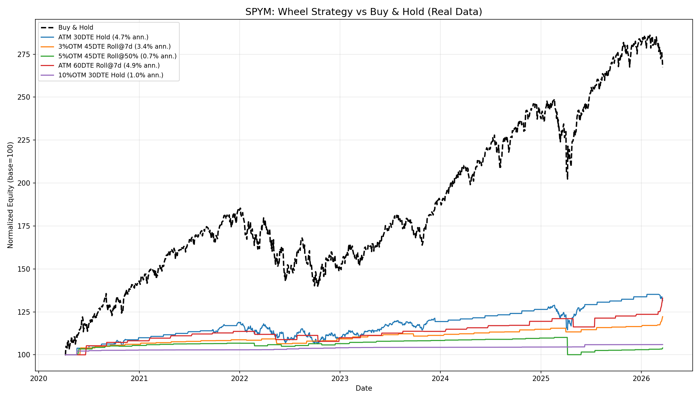

# Wheel Strategy Study — Real Market Data (Yahoo Finance)

**Data Period:** ~6 years (Feb 2020 - Mar 2026)
**Tickers:** AAPL, AMD, JPM, KO, T, IWM, QQQM, SCHD, SPYM
**Total Configurations Tested:** 144 per ticker (4 strikes x 3 DTEs x 4 roll methods x 3 periods)

All results use **real daily closing prices** downloaded from Yahoo Finance via `yfinance`.

---

## Tickers & Rationale

| Ticker | Category | Profile |
|--------|----------|---------|
| AAPL | Blue-chip tech | Growth, moderate IV |
| AMD | Semiconductor | High IV, volatile growth |
| JPM | Financials | Dividends, moderate growth |
| KO | Consumer staples | Dividend aristocrat, stable |
| T | Telecom | Low-priced, high yield, range-bound |
| IWM | Small-cap ETF | Broad market, higher IV |
| QQQM | Nasdaq-100 mini | Tech-heavy growth ETF |
| SCHD | Dividend ETF | Quality dividend, stable |
| SPYM | S&P 500 mini | Broad market, moderate IV |

---

## Buy & Hold vs Wheel Strategy — The Bottom Line

The central question: **should you just buy and hold, or run the wheel?**

Over the 2020-2026 bull market, **buy & hold wins decisively on 8 of 9 tickers.**

### 5Y Annualized Returns: Buy & Hold vs Best Wheel Config

| Ticker | Buy & Hold Ann% | Best Wheel Ann% | Avg Wheel Ann% | B&H Advantage |
|--------|:-:|:-:|:-:|:-:|
| AMD | **19.5%** | 12.3% | 5.6% | +7.2% |
| JPM | **16.2%** | 6.7% | 2.6% | +9.5% |
| AAPL | **15.2%** | 7.7% | 3.4% | +7.5% |
| QQQM | **13.4%** | 5.1% | 2.1% | +8.3% |
| SPYM | **12.0%** | 7.2% | 1.8% | +4.8% |
| T | **11.6%** | 5.6% | 2.5% | +6.0% |
| KO | **11.1%** | 5.0% | 2.1% | +6.1% |
| SCHD | **8.6%** | 4.9% | 1.8% | +3.7% |
| IWM | 2.3% | **5.7%** | 2.5% | Wheel wins |

### 5Y Total Returns: Buy & Hold

| Ticker | 5Y Total Return | 3Y Ann% | 1Y Ann% |
|--------|:-:|:-:|:-:|
| AMD | +143.3% | 27.7% | 87.9% |
| JPM | +112.0% | 33.0% | 22.4% |
| AAPL | +102.8% | 17.3% | 16.3% |
| QQQM | +87.8% | 24.6% | 22.1% |
| SPYM | +76.5% | 19.6% | 16.4% |
| T | +72.9% | 22.0% | 10.3% |
| KO | +69.4% | 10.7% | 10.3% |
| SCHD | +51.0% | 12.5% | 13.0% |
| IWM | +11.9% | 12.7% | 19.4% |

**Key insight:** The wheel only outperforms when the underlying has weak or flat price action (IWM's 2.3% annualized over 5Y). In any market with meaningful upside, the wheel's capped gains are a significant drag.

---

## Key Findings

### 1. Wheel Strategy Significantly Underperforms Buy & Hold in Bull Markets

The 2020-2026 period was dominated by strong equity returns. Across **8 of 9 tickers**, the wheel strategy underperformed buy & hold. This is expected — the wheel caps upside at the strike price while still bearing full downside risk.

The wheel's **best** 5Y config averaged 6.8% annualized across all tickers, while buy & hold averaged **12.1%** — a gap of 5.3 percentage points per year.

### 2. Best Configuration: ATM Strike, 60 DTE, Roll @7d Before Expiry

This combination dominated the 1Y and 3Y results across most tickers:

**1Y Best Config per Ticker:**

| Ticker | Strike | DTE | Roll | Ann. Ret% | Max DD% | Win Rate |
|--------|--------|-----|------|-----------|---------|----------|
| AMD | ATM | 60 | Roll @7d | 87.9% | 0.0% | 100.0% |
| AAPL | ATM | 60 | Roll @7d | 39.0% | -1.7% | 91.7% |
| JPM | ATM | 60 | Roll @7d | 33.2% | -1.9% | 91.7% |
| T | ATM | 60 | Roll @7d | 32.0% | -4.1% | 91.7% |
| IWM | ATM | 60 | Roll @7d | 31.1% | 0.0% | 100.0% |
| QQQM | ATM | 60 | Roll @7d | 25.8% | 0.0% | 100.0% |
| SPYM | ATM | 60 | Roll @7d | 19.3% | 0.0% | 100.0% |
| KO | ATM | 60 | Roll @7d | 18.4% | -1.6% | 91.7% |
| SCHD | ATM | 60 | Roll @7d | 15.8% | 0.0% | 100.0% |

### 3. Over Longer Periods, Hold-to-Expiry Becomes Competitive

**5Y Best Config per Ticker:**

| Ticker | Strike | DTE | Roll | Ann. Ret% | Max DD% | Win Rate | Cycles |
|--------|--------|-----|------|-----------|---------|----------|--------|
| AMD | ATM | 60 | Roll @7d | 12.3% | -10.5% | 77.4% | 0 |
| AAPL | 10% OTM | 30 | Hold | 7.7% | -15.9% | 95.0% | 2 |
| SPYM | 10% OTM | 45 | Hold | 7.2% | -10.8% | 96.3% | 1 |
| JPM | ATM | 60 | Roll @7d | 6.7% | -6.4% | 80.6% | 0 |
| IWM | ATM | 60 | Roll @7d | 5.7% | -8.5% | 80.6% | 0 |
| T | ATM | 30 | Hold | 5.6% | -14.0% | 92.5% | 4 |
| QQQM | ATM | 30 | Hold | 5.1% | -18.4% | 87.5% | 5 |
| KO | ATM | 45 | Hold | 5.0% | -11.1% | 85.2% | 5 |
| SCHD | ATM | 45 | Hold | 4.9% | -8.2% | 88.9% | 6 |

---

## Aggregate Analysis

### By Strike Selection (all tickers, all periods)

| Strike | Avg Ann. Return% | Avg Max DD% | Avg Win Rate | Avg Cycles |
|--------|:-:|:-:|:-:|:-:|
| ATM | 8.46% | -8.25% | 79.6% | 0.71 |
| 3% OTM | 7.12% | -6.74% | 84.5% | 0.50 |
| 5% OTM | 5.79% | -5.66% | 86.6% | 0.40 |
| 10% OTM | 3.65% | -3.29% | 83.4% | 0.25 |

**Takeaway:** ATM produces the highest returns but with deeper drawdowns. Wider OTM strikes trade return for safety.

### By Roll Method (all tickers, all periods)

| Roll Method | Avg Ann. Return% | Avg Max DD% | Avg Win Rate | Avg Premium |
|-------------|:-:|:-:|:-:|:-:|
| Roll @7d Before | 10.33% | -4.54% | 84.4% | $10,021 |
| Hold to Expiry | 5.23% | -9.93% | 88.9% | $4,293 |
| Roll @50% Profit | 5.19% | -5.07% | 78.8% | $7,725 |
| Roll @75% Profit | 4.26% | -4.40% | 81.9% | $5,922 |

**Takeaway:** Rolling 7 days before expiry is the clear winner — highest returns, lowest drawdowns, and highest premium collected.

### By DTE (all tickers, all periods)

| DTE | Avg Ann. Return% | Avg Max DD% | Avg Win Rate | Avg Trades |
|-----|:-:|:-:|:-:|:-:|
| 60 | 7.11% | -5.86% | 84.6% | 16.4 |
| 45 | 6.32% | -5.38% | 84.0% | 20.9 |
| 30 | 5.34% | -6.71% | 81.9% | 30.5 |

**Takeaway:** Longer DTE (60 days) provides better risk-adjusted returns with fewer trades and higher win rates.

---

## Equity Curve Comparisons

### AAPL — Buy & Hold Dominates

AAPL's strong uptrend (100 -> 450+) makes buy & hold unbeatable. The wheel captures only a fraction of the upside.

### AMD — High Volatility, Modest Wheel Returns

AMD's extreme volatility generates good premiums, but the capped upside limits total returns vs the stock's 5x appreciation.

### JPM — Steady Growth Favors B&H

JPM's consistent rally from ~100 to 400+ leaves the wheel far behind.

### KO — Closer Match (Stable Stock)

KO's moderate, range-bound behavior makes the wheel more competitive. The 3%OTM 45DTE Roll@7d config tracks closest to buy & hold.

### T — Competitive Wheel Candidate

T's range-bound price action (mostly $15-25) makes it a suitable wheel candidate. The ATM 30DTE Hold config nearly matches buy & hold, but B&H still edges ahead over 5Y.

### IWM — Wheel Wins (Weak B&H)

IWM is the **only ticker where the wheel outperforms buy & hold** over 5 years. Small caps returned just 2.3% annualized — the wheel's premium income fills the gap.

### QQQM — Tech Growth Caps Wheel Upside

Similar to AAPL — strong tech growth makes buy & hold the clear winner.

### SCHD — Dividend ETF, Moderate Gap

SCHD's steadier growth narrows the gap vs the wheel, but buy & hold still wins over 5 years.

### SPYM — S&P 500 Broad Market, B&H Wins

SPYM tracks the S&P 500. The broad market's 12% annualized return over 5 years is roughly double what the best wheel config achieves (7.2%).

---

## Conclusions (Real Data vs Synthetic)

1. **Synthetic data was overly optimistic.** The synthetic study showed the wheel performing well on "STABLE" and "DIVIDEND" profiles. Real data shows it underperforms buy & hold across nearly all tickers in a bull market.

2. **The wheel is an income strategy, not a growth strategy.** It generates steady premium income (2-8% annualized) but caps upside in trending markets. Over 5 years, the average wheel config returned **~3% annualized** vs **~12% for buy & hold**.

3. **The wheel only wins when the underlying is flat or declining.** IWM (2.3% B&H annualized) was the only ticker where the wheel outperformed. This suggests the wheel is best deployed in sideways or bearish markets, not as a permanent strategy.

4. **Best real-world candidates:** Range-bound, high-IV stocks where premium income can match or exceed capital appreciation. Avoid wheeling high-growth names.

5. **Optimal configuration (real data):**
   - **Strike:** ATM or 3% OTM (balance of premium vs safety)
   - **DTE:** 45-60 days (higher win rate, fewer transactions)
   - **Roll Method:** Roll @7d before expiry (best risk-adjusted returns)

6. **When NOT to wheel:** High-growth stocks (AAPL, AMD, QQQM) — the opportunity cost of capped gains far exceeds the premium income. If you believe the stock will appreciate significantly, buy & hold is the superior strategy.

7. **Caveat:** This study covers a predominantly bull market (2020-2026). The wheel may outperform during extended bear markets or high-volatility sideways periods, since premium income provides a buffer that buy & hold lacks. A study spanning a full market cycle (including a bear market) would provide a more balanced comparison.

---

## How to Run

```bash
# Run all default tickers
python wheel_study_real.py

# Run specific tickers
python wheel_study_real.py --tickers AAPL MSFT GOOGL

# Adjust data window
python wheel_study_real.py --years 8
```

## Output Files

| File | Description |
|------|-------------|
| `{TICKER}_study_results.csv` | Full parameter study results (144 rows per ticker) |
| `{TICKER}_study_charts.pdf` | Multi-page PDF with bar charts, scatter plots, heatmaps |
| `{TICKER}_equity_comparison.png` | Equity curves vs buy & hold |
| `all_tickers_real_study.csv` | Combined cross-ticker results |
